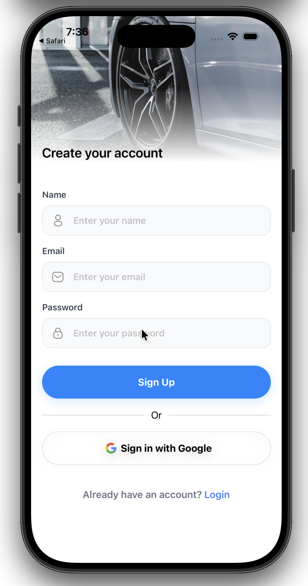
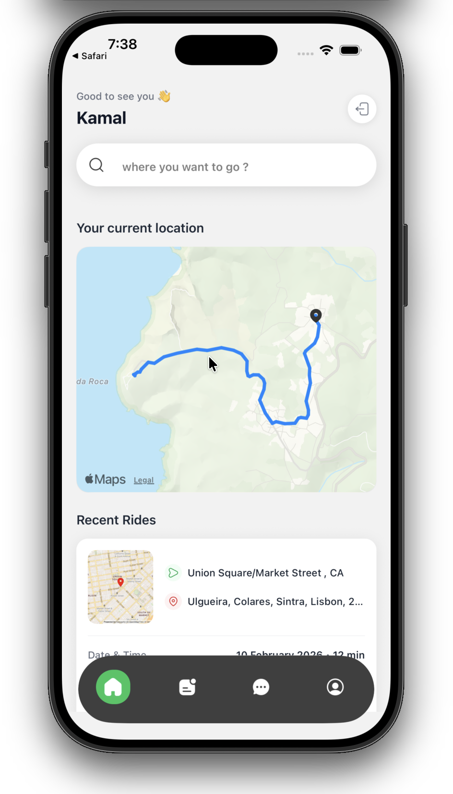
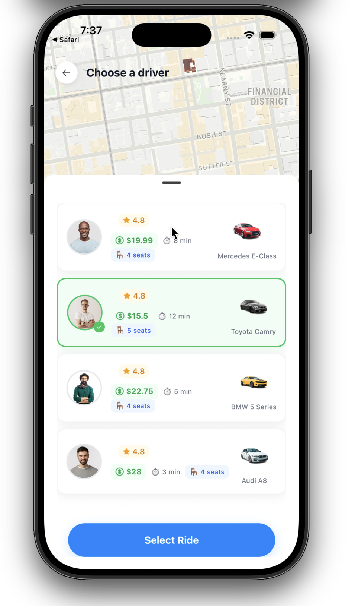
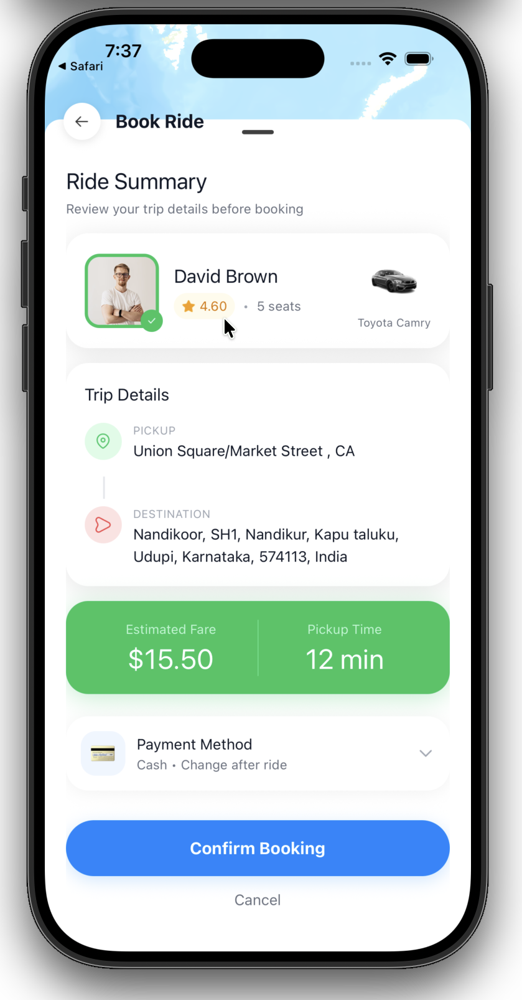

# 🚗 Ryde — Ride-Hailing Mobile App

A full-stack ride-hailing mobile application built with **React Native** and **Expo**, featuring real-time maps, secure authentication, and a seamless booking experience.

---

## 📸 Screenshots

<p align="center">
  
  &nbsp;&nbsp;
  
  &nbsp;&nbsp;
  
</p>

<p align="center">
  
  &nbsp;&nbsp;
  
</p>

---

## ✨ Features

- **Onboarding Flow** — Beautiful swipeable onboarding screens to introduce the app
- **Authentication** — Secure sign-up & login with email and Google OAuth via Clerk
- **Home Screen** — Interactive map with live location tracking and nearby drivers
- **Ride Search** — Search for destinations with autocomplete powered by OpenStreetMap
- **Ride Selection** — Browse available drivers, view ratings, pricing, and estimated time
- **Ride Booking** — Confirm and book rides with route directions displayed on the map
- **Ride History** — View past rides with details like origin, destination, date, and driver info
- **Profile & Chat** — User profile management and in-app chat tabs
- **Bottom Tab Navigation** — Smooth bottom tab bar with Home, Rides, Chat, and Profile

---

## 🛠 Tech Stack

| Category         | Technology                                                                               |
| ---------------- | ---------------------------------------------------------------------------------------- |
| **Framework**    | [React Native](https://reactnative.dev/) + [Expo SDK 54](https://expo.dev/)              |
| **Routing**      | [Expo Router](https://docs.expo.dev/router/introduction/) (file-based)                   |
| **Styling**      | [NativeWind](https://www.nativewind.dev/) (TailwindCSS for React Native)                 |
| **Auth**         | [Clerk](https://clerk.com/)                                                              |
| **Database**     | [Neon (Serverless Postgres)](https://neon.tech/)                                         |
| **Maps**         | [React Native Maps](https://github.com/react-native-maps/react-native-maps) + Directions |
| **State**        | [Zustand](https://zustand-demo.pmnd.rs/)                                                 |
| **Animations**   | [React Native Reanimated](https://docs.swmansion.com/react-native-reanimated/)           |
| **Bottom Sheet** | [@gorhom/bottom-sheet](https://gorhom.github.io/react-native-bottom-sheet/)              |
| **Payments**     | Stripe (via custom integration)                                                          |

---

## 📁 Project Structure

```
ryde/
├── app/
│   ├── (api)/              # API routes (driver, ride endpoints)
│   ├── (auth)/             # Auth screens (welcome, login, signup)
│   ├── (authenticated)/    # Protected screens
│   │   ├── (tabs)/         # Tab screens (home, rides, chat, profile)
│   │   ├── find-ride.jsx   # Search for rides
│   │   ├── confirm-ride.jsx# Confirm ride details
│   │   └── book-ride.jsx   # Book & pay for ride
│   ├── _layout.jsx         # Root layout
│   └── index.jsx           # Entry point
├── components/             # Reusable UI components
│   ├── Map.jsx             # Map with markers & directions
│   ├── DriverCard.jsx      # Driver info card
│   ├── RideCard.jsx        # Ride history card
│   ├── Payment.jsx         # Payment component
│   ├── OsmSearchBar.jsx    # Location search bar
│   └── ...
├── constants/              # App constants
├── lib/                    # Utility functions
├── store/                  # Zustand state management
└── assets/                 # Images, icons, fonts
```

---

## 🚀 Getting Started

### Prerequisites

- [Node.js](https://nodejs.org/) (v18+)
- [Expo CLI](https://docs.expo.dev/get-started/installation/)
- iOS Simulator / Android Emulator / Physical device

### Installation

1. **Clone the repository**

   ```bash
   git clone https://github.com/yourusername/ryde.git
   cd ryde
   ```

2. **Install dependencies**

   ```bash
   npm install
   ```

3. **Set up environment variables**

   Create a `.env` file in the root directory with:

   ```env
   EXPO_PUBLIC_CLERK_PUBLISHABLE_KEY=your_clerk_key
   DATABASE_URL=your_neon_database_url
   EXPO_PUBLIC_GOOGLE_API_KEY=your_google_api_key
   EXPO_PUBLIC_STRIPE_PUBLISHABLE_KEY=your_stripe_key
   ```

4. **Start the development server**

   ```bash
   npx expo start
   ```

5. **Run on device**
   - Press `i` to open in iOS Simulator
   - Press `a` to open in Android Emulator
   - Scan the QR code with Expo Go on your phone

---

## 📄 License

This project is for educational and personal use.
